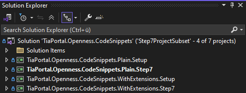
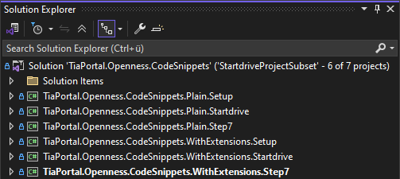
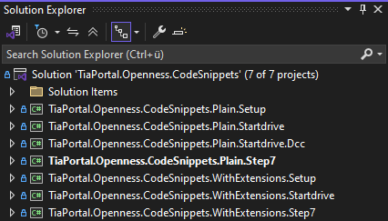

# TIA Portal Openness Code Snippets

## Table of Contents

1. [Goal](#goal)
2. [Features](#features)
3. [Getting Started](#getting-started)
4. [Requirements](#requirements)
5. [Contributing](#contributing)
6. [License](#license)

## Goal

This repository provides small, easy-to-understand code snippets demonstrating how to work with the latest TIA Portal Openness API (currently V20).

Use this repository to learn and experiment with the TIA Portal Openness API in a modular way.

> **Note:**  
> The test methods in this repository are intended for demonstration and experimentation only.  
> They are **not** real test cases and do **not** use any assertions.
> The TestFramework is used solely to enable the execution of each method individually.

## Features

- Modular code snippets for TIA Portal Openness API (V20).
- Automatically starts a TIA Portal instance if not already running.
- Test methods for easy execution and experimentation.
- Support for different TIA Portal setups:
  - Step7
  - Step7 + Startdrive
  - Step7 + Startdrive + Dcc

## Getting Started

Follow these steps to set up and use the repository:

1. **Clone the Repository**

   ```bash
   git clone https://github.com/siemens/tia-portal-openness-code-snippets.git
   cd tia-portal-openness-code-snippets
   ```

2. Install Dependencies
Ensure you have the required version of TIA Portal installed (see the "Requirements" section below).

3. Open the Solution

4. Run Tests
Execute the test methods to explore the code snippets. Each snippet is designed to run independently.

Based on your TIA Portal setup, open the appropriate solution file (.slnf or .sln) as described in the "Requirements" section.
Run Tests
Execute the test methods to explore the code snippets. Each snippet is designed to run independently.

## Requirements

To build the project, select the appropriate solution filter file (`.slnf`) or the full solution file (`.sln`) based on your TIA Portal installation setup:

### 1. Installed Step7

Use the following solution filter file: [Step7ProjectSubset.slnf](src/Step7ProjectSubset.slnf)



---

### 2. Installed Step7 + Startdrive

Use the following solution filter file: [StartdriveProjectSubset.slnf](src/StartdriveProjectSubset.slnf)



---

### 3. Installed Step7 + Startdrive + Dcc

Use the full solution file: [TiaPortal.Openness.CodeSnippets.sln](src/TiaPortal.Openness.CodeSnippets.sln)



## Contributing

We welcome contributions to improve this repository! Here's how you can contribute: Check [CONTRIBUTING.md](/CONTRIBUTING.md)

## License

© Siemens 2025

Licensed under: "Royalty-free Software provided by Siemens on sharing platforms for developers/users of Siemens products". See [LICENSE.md](/LICENSE.md).
